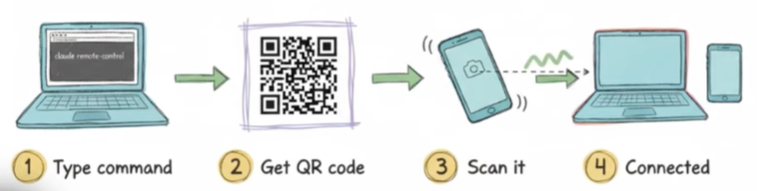
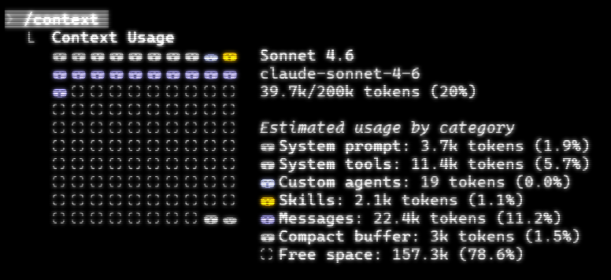
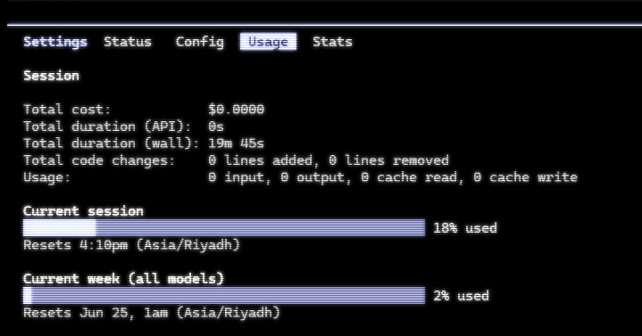
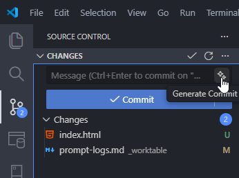
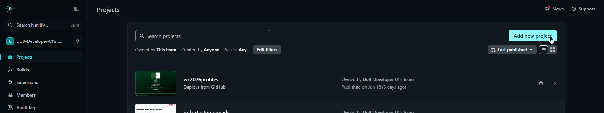
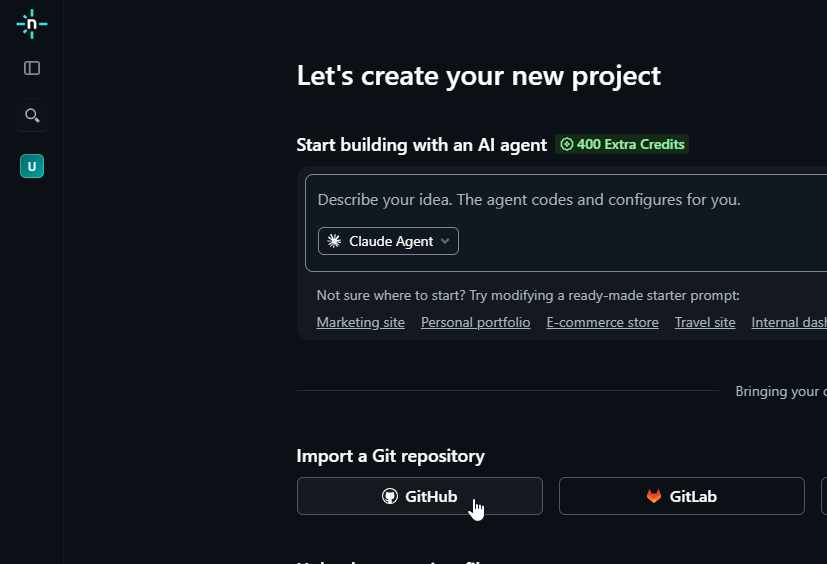
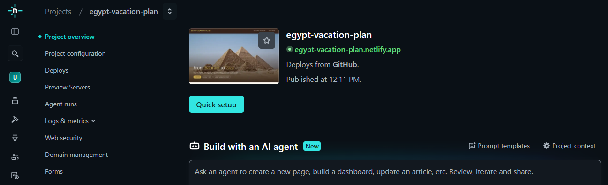

<!--  -->


<!--  -->
<!-- <h1 style="display:inline;"> Claude Code Development Reference </h1> --> 

# Claude Code Mini-Session Reference

## What is it

Primarily, a CLI based tool that allows use of Claude directly on a machine giving it access and control over system resources.

## Why use it

You can use Claude do pretty much any work that could be done on a machine, not just coding.

### Example Usecases

- Build applications
- Build automation workflows (custom or n8n)
- Build ML models and applications
- Create word documents, powerpoints, PDFs, etc.
- Write a novel
- Run a business
- Plan your next trip
- etc.

## Pricing

https://claude.com/pricing

## Precautions

- Work in a sandbox for security and privacy.
- Control what data is shared with Anthropic: https://code.claude.com/docs/en/data-usage  
- Be aware of prompt injection if you process any external user input, besides other security considerations: https://code.claude.com/docs/en/security  

## Optional: Install Windwos Terminal

Windows terminal is the official modern, fast, efficient, powerful, and productive terminal application for users of command-line tools and shells. 

https://apps.microsoft.com/detail/9n0dx20hk701

**Ad:** https://www.youtube.com/watch?v=8gw0rXPMMPE

## Install Claude Code

Note: Subscription needed.

```
# MacOS/Linux:
curl -fsSL https://claude.ai/install.sh | bash

# Homebrew (MacOS):
brew install --cask claude-code

# Windows (Powershell. Does not seem to work reliably):
irm https://claude.ai/install.ps1 | iex
# Windows (CMD):
>curl -fsSL https://claude.ai/install.cmd -o install.cmd && install.cmd && del install.cmd

# NPM:
npm install -g @anthropic-ai/claude-code
NOTE: If installing with NPM, you also need to install Node.js 18+
Navigate to your project directory and run claude.
```

## Updating Claude Code 

- `claude update` update to latest version  
- `claude --version` check current version  

## Start a sesison

- `claude` to start claude in regular mode (requests for approval before taking many actions)

  or

- `claude --dangerously-skip-permissions` to bypass constant requests for approval beofre taking actions

  or

- `claude remote-control` to be able to control the session from any device including your mobile

  

## Basic slash commands

- `/login` needed the fist time you use claude code to authenticate with your account
- `/copy` copies a summary of the work done after claude is done - working
- `/clear` clears memory and starts a clean new chat session
- `/model` switch between available models
- `/context` check current chat memory utlization

  

- `/status` check remaining available quota (5 hours limit and, weekly limit) (use the tab button to jump to the Usage tab)

  

-  `/voice` toggle voice to be able to transcribe your prompts

## Basic keyboard shortcuts

- `shift + tab` cycle between modes (plan, manual approve, force approve)  
- `ctr +j` new line
- `alt + v` paste images and files into your terminal
- `ctr + c` cancel current work
- `ctr + c (twice)` exit session

<!-- ## Basic workflow

- 
- 
- 
- 
-  -->

<!-- ## Generate commit message 

 -->

<!-- ## Appendix: Deploy your site to netlify

If you have a website you can freely host it on netlify. 





 -->


## Appendix: Setup the AI agent CLI tool to trigger an audio notification when done or in need of assistance


### 1. Generate LLM done and need assistance audio clips

For this you can use AI studio

https://aistudio.google.com/generate-speech?model=gemini-3.1-flash-tts-preview

**example settings:**

- type style, e.g. regular friendly tone
- select a voice, e.g. Algieba voice
- generate and download text clip "All done!" 
- generate and download text clip "Asstance Please!" 


### 2. Configure hooks in Claude or Gemini
----

#### Claude 

https://code.claude.com/docs/en/hooks

```json
{
  "model": "sonnet",
  "hooks": {
    "Notification": [
      {
        "matcher": "permission_prompt",
        "hooks": [
          {
            "type": "command",
            "command": "powershell -NoProfile -Command \"(New-Object System.Media.SoundPlayer 'C:\\Users\\Win\\.claude\\assistance-please.wav').PlaySync()\""
          }
        ]
      }
    ],
    "Stop": [
      {
        "matcher": "",
        "hooks": [
          {
            "type": "command",
            "command": "powershell -NoProfile -Command \"(New-Object System.Media.SoundPlayer 'C:\\Users\\Win\\.claude\\all-done.wav').PlaySync()\""
          }
        ]
      }
    ]
  },
  "enabledPlugins": {
    "sample-plugin@my-plugins-market": true,
    "document-skills@anthropic-agent-skills": true,
    "skill-creator@claude-plugins-official": true,
    "frontend-design@claude-plugins-official": true
  },
  "autoMemoryEnabled": false,
  "skipDangerousModePermissionPrompt": true,
  "autoCompactEnabled": false,
  "agentPushNotifEnabled": true
}
```

#### Gemini

https://geminicli.com/docs/hooks/

```json
{
    "hooks": {
    "Notification": [
        {
            "matcher": "permission_prompt",
        "hooks": [
            {
                "type": "command",
            "command": "powershell -NoProfile -Command \"(New-Object System.Media.SoundPlayer 'C:\\Users\\Win\\.gemini\\assistance-please-m.wav').PlaySync()\""
          }
        ]
      }
    ],
    "AfterAgent": [
        {
            "matcher": "",
        "hooks": [
          {
              "type": "command",
            "command": "powershell -NoProfile -Command \"(New-Object System.Media.SoundPlayer 'C:\\Users\\Win\\.gemini\\all-done-m.wav').PlaySync()\""
          }
        ]
      }
    ]
  },
  "ide": {
      "hasSeenNudge": true,
    "enabled": true
  },
  "mcpServers": {},
  "security": {
      "auth": {
          "selectedType": "oauth-personal"
    }
  },
  "general": {
      "previewFeatures": false,
    "sessionRetention": {
      "warningAcknowledged": true,
      "enabled": true,
      "maxAge": "30d"
    }
  }
}
```

## Appendix: Give Claude Code control over the chrome browser

**Chrome extension (required):** https://claude.com/chrome  

After installation, start a sesison using `claude --chrome`

Example prompt: 

```bash
Browse and create a general md format report on the following site: example.com (include screenshots)
```